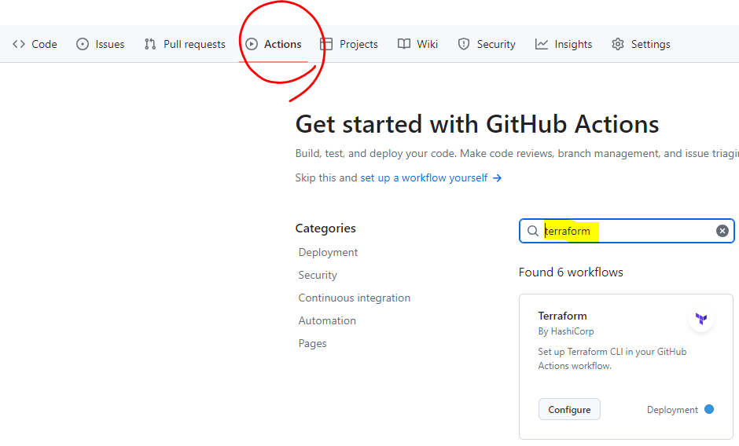
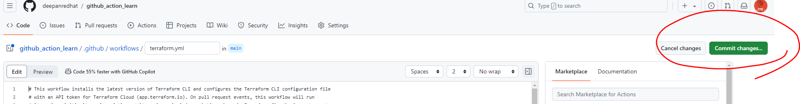
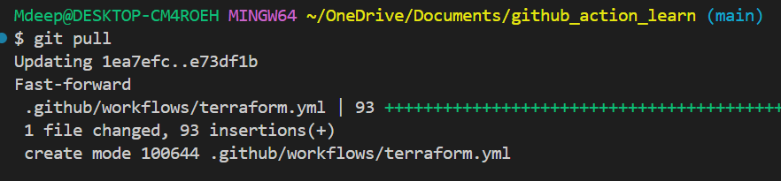
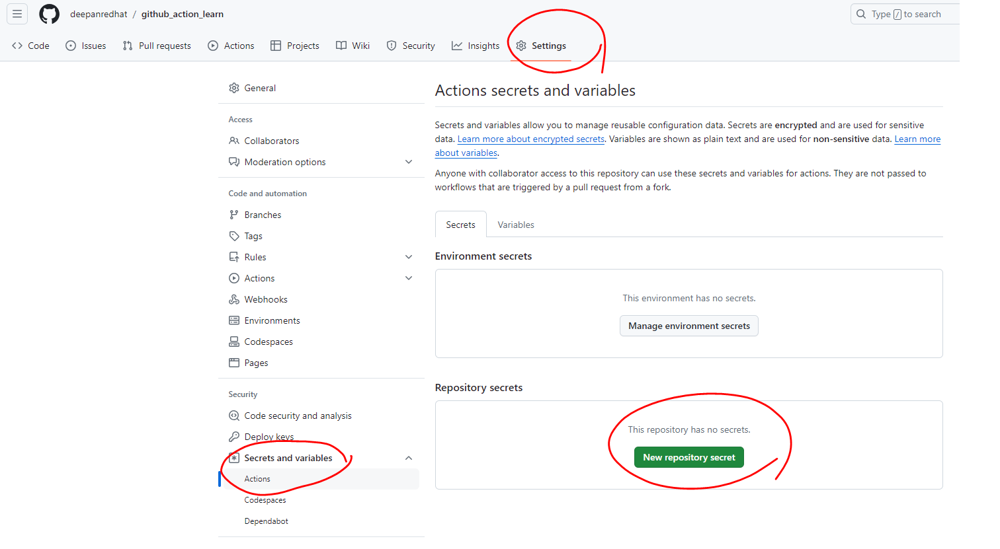
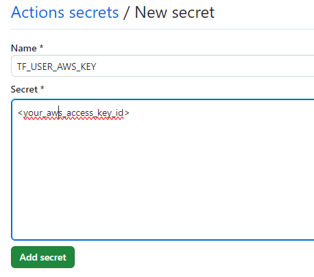
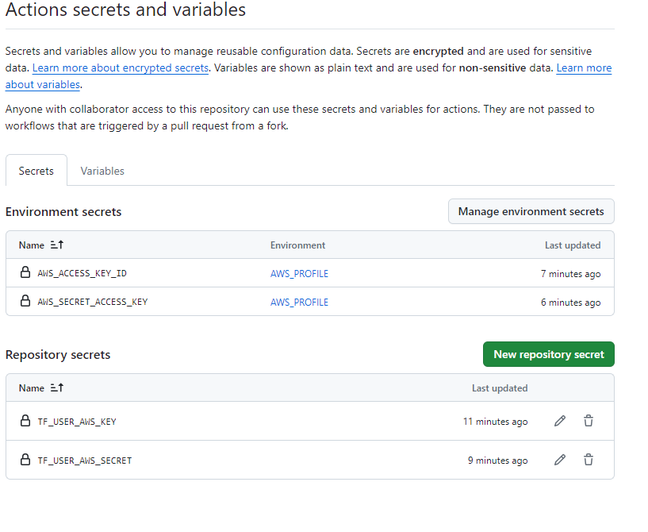
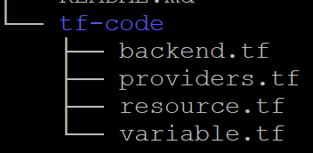
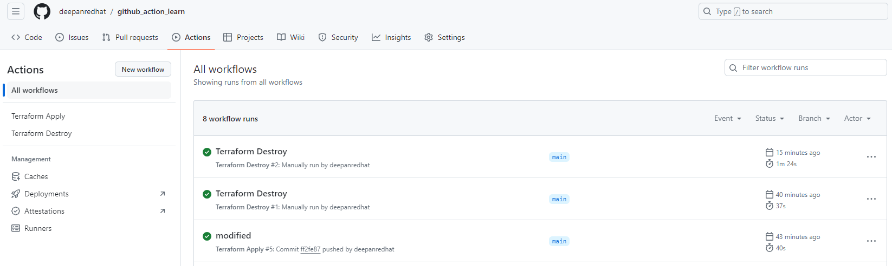
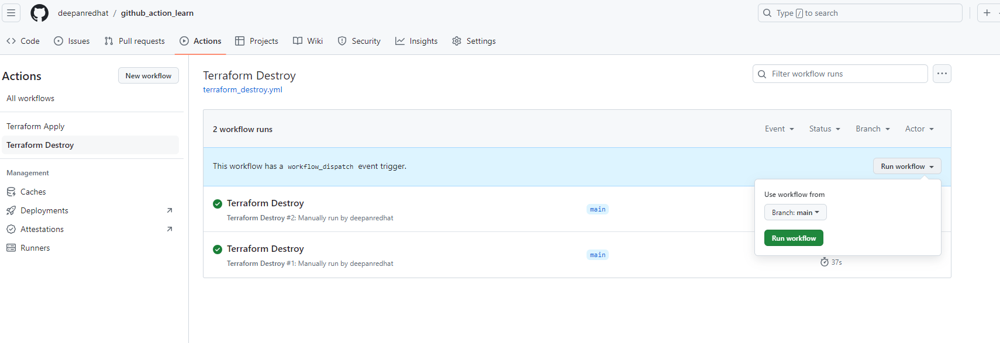

<h1 font size="24" color="green">GITHUB_ACTION_LEARN <h1/>
This repo to learn about github action workflow 
By using terraform provisioning resource to AWS  

Pre-requisites:- 
1, AWS access and secrets key 
2, s3 bucket 
3, dynamoDB  

Step 1:- Create a new repo in GITHUB or use the exisiting repo. 
#git clone <your_repo> 

Step 2:- Create action workflow. 
 
--> Click configure --> then select commit button. 
 

Step 3:- pull and rebase the code. 
#git pull 
#git rebase 
 

Step 4:- Create the workflow file under .github\workflows 
File 1:- Terraform_apply [a relative link](.github/workflows/terraform_apply.yml) 
File 2:- Terraform_destroy [a relative link](.github/workflows/terraform_destroy.yml) 

Step 5:- Add the AWS Secret keys in your github secerets. 
Click --> Settings then --> secrets and variables --> then click --> Actions 
 

-->Add your AWS secrets and make sure the name which should be match with your workflow secrets name. 
--> Create the environment profile  and add the secret keys in the name of {AWS_PROFILE}. 
 

--> Secrets OutPut:- 
 

Step 6:- Create a folder tf_code and keep all terraform code inside. 
Note:- I have placed the reference code, kindly read the code and modify your code accordingly or you can place your code and do the test. 
  
Make sure to change your value on terraform.tfvars and backend.tf. 
File 1:- terraform.tfvars [a relative link](tf-code/terraform.tfvars) 
File 2:- backend.tf [a relative link](tf-code/backend.tf) 

Step 7:- Final steps and output. 
 

Note:- When you push terraform apply workflow will run automatically, however to destroy you need to run workflow manually. 

